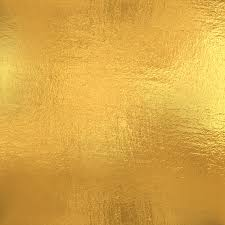
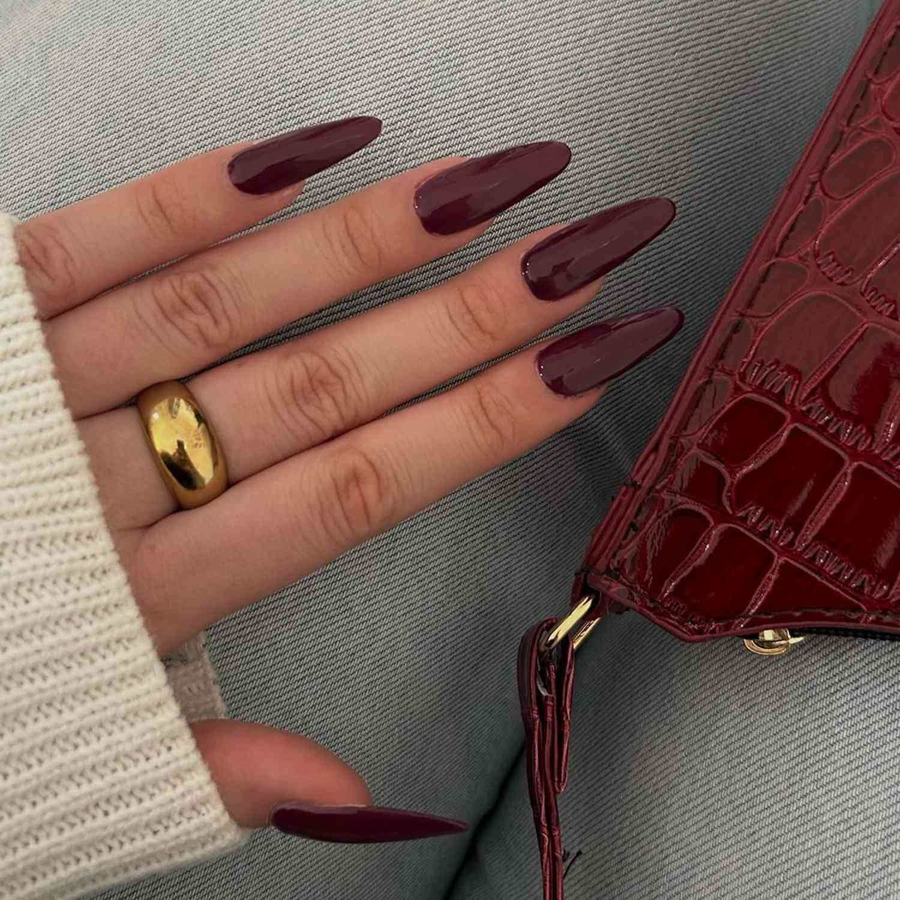
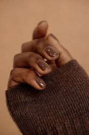
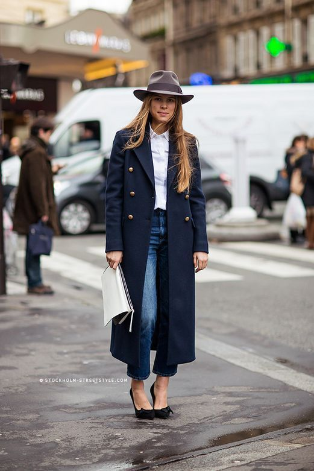
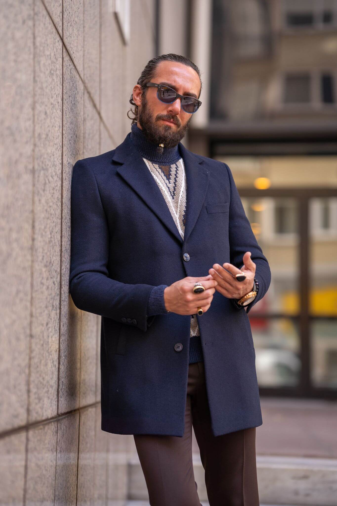

<!DOCTYPE html>
<html lang="en-US">
<head>
<meta charset="UTF-8">
<meta http-equiv="X-UA-Compatible" content="IE=edge">
<meta name="viewport" content="width=device-width, initial-scale=1">
<meta name="generator" content="Jekyll v3.10.0" />
<meta property="og:title" content="DKDimiKim" />
<meta property="og:locale" content="en_US" />
<meta name="description" content="FashionInspo2024" />
<meta property="og:description" content="FashionInspo2024" />
<link rel="canonical" href="https://dkdimikim.github.io/" />
<meta property="og:url" content="https://dkdimikim.github.io/" />
<meta property="og:site_name" content="DKDimiKim" />
<meta property="og:type" content="website" />
<meta name="twitter:card" content="summary" />
<meta property="twitter:title" content="DKDimiKim" />
</head>
<body>
    <main>
        <h1>Fashion Inspo for 2024 by DimiK</h1>
        <h2>Fall/Winter Edition</h2>
        <figure>
            
            <figcaption>Nice winter day in Paris, France, the capital of fashion. Ignore my hiking boots. Thanks, xoxo.</figcaption>
        </figure>
        
Thank you for participating in my first try to create some content online, where my fashion inspo for 2024 will be all about my favorite colors and designers.

        
We will break down some of my favorite designers and luxury brands.

        <ul>
            <li>Chanel - <a href="https://www.chanel.com/gr/" target="_blank">Official site</a></li>
            <li>Color Black, like the Little Black Dress.
                <figure>
                    
                </figure>
            </li>
            <li>Alexander McQueen - <a href="https://www.alexandermcqueen.com/en-gr" target="_blank">Official site</a></li>
            <li>Christian Dior - <a href="https://www.dior.com/en_gr?msockid=19ff41598dc262e6031855db8c026344" target="_blank">Official site</a></li>
            <li>Color Bordeaux and palette, deep like wine.
                <figure>
                    
                    
                </figure>
            </li>
            <li>Fendi - <a href="https://www.fendi.com/gr-en/" target="_blank">Official site</a></li>
            <li>Versace - <a href="https://www.versace.com/us/en/" target="_blank">Official site</a></li>
            <li>Color Gold and Gold jewelry.
                <figure>
                    
                    
                </figure>
            </li>
            <li>Ralph Lauren - <a href="https://www.ralphlauren.eu/gr/en/women/clothing/2020" target="_blank">Official site</a></li>
            <li>Miu Miu - <a href="https://www.miumiu.com/ww/en.html" target="_blank">Official site</a></li>
            <li>Schiaparelli - <a href="https://www.schiaparelli.com/en" target="_blank">Official site</a></li>
            <li>Color Mocha, great for nails.
                <figure>
                    
                    
                </figure>
            </li>
            <li>Pierre Cardin - <a href="https://www.cardinworld.com/" target="_blank">Official site</a></li>
            <li>Color Navy Blue.
                <figure>
                    
                    
                </figure>
            </li>
            <li>Miuccia Prada through British Vogue top 12 styles - <a href="https://www.vogue.fr/fashion/article/vogue-looks-back-on-miucci-pradas-12-greatest-style-moments" target="_blank">Official British Vogue site</a></li>
        </ul>
</main> 
<footer>Copyright Dimitra Kimouli</footer>
</body>
</html>
